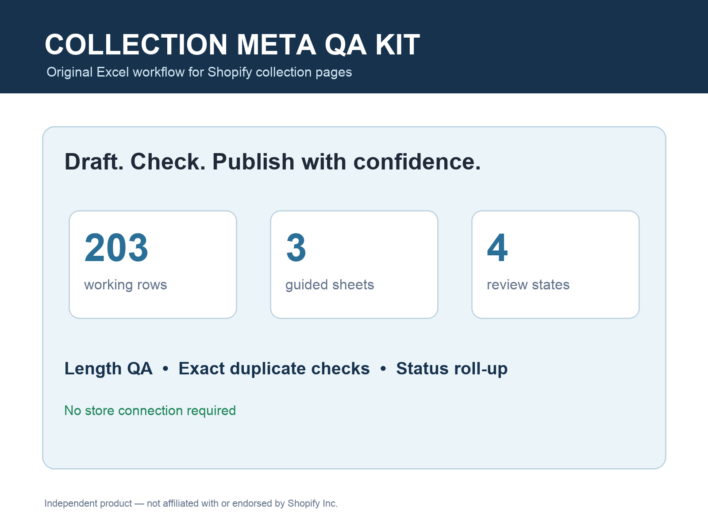
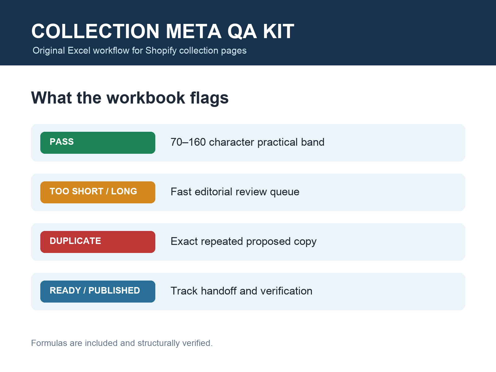
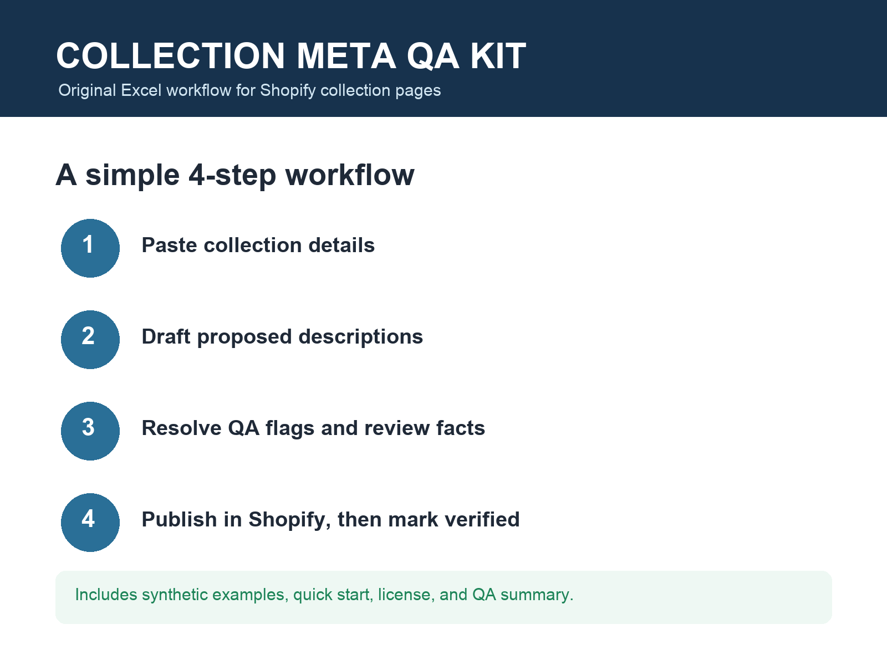

# Shopify Collection Meta QA Kit — public preview

A public evaluation page for an original Excel workflow that helps ecommerce operators draft, review, and track collection-page meta descriptions before publication.

**Looking for a free audit template?** Use the focused [free Shopify collection SEO audit template](free-shopify-collection-seo-audit-template.html) for a direct XLSX download, field checklist, limits, and a four-step evaluation path.

**Try the workflow before requesting anything:** [download the free formula-working 10-row XLSX](https://github.com/Kndll33/shopify-collection-meta-qa-kit-preview/releases/download/preview-v1.0.1/shopify-collection-meta-qa-kit-free-10-row-v1.0.1.xlsx), [inspect the finished public example](https://github.com/Kndll33/shopify-collection-meta-qa-kit-preview/blob/main/samples/underwaterpistol-fishsociety-README.md), or [download that example as CSV](https://raw.githubusercontent.com/Kndll33/shopify-collection-meta-qa-kit-preview/main/samples/underwaterpistol-fishsociety-public-fitcheck.csv). The example reports only public-page status, titles, metadata, canonicals, and review cues; it makes no ranking promise. None of these routes requires email, login, store access, or a form.

**Fast decision:** choose this workbook when you need an offline Excel review/handoff queue and cannot or do not want to install a store-connected app. Choose a Shopify app instead when you need automatic store crawling, generation, or publishing. [Download the exact 10-row workbook first](https://github.com/Kndll33/shopify-collection-meta-qa-kit-preview/releases/download/preview-v1.0.1/shopify-collection-meta-qa-kit-free-10-row-v1.0.1.xlsx); if its formulas and workflow fit, [request the 203-row $19 pack](https://github.com/Kndll33/shopify-collection-meta-qa-kit-preview/issues/new?template=buyer-pack.yml&title=%5Bgithub-repo%5D%20Shopify%20Meta%20QA%20buyer%20pack).

| Need | This workbook | Store-connected SEO app |
| --- | --- | --- |
| Review and handoff in Excel | Yes | Varies |
| Store login or app install | No | Usually required |
| Automatic crawl/write/publish | No | Use an app for this |
| Test before requesting | Free working 10-row XLSX | Check the app's current trial/free tier |
| Ongoing subscription | No; $19 one-time buyer pack | Depends on the app |

## Shopify collection description vs SEO meta description

A Shopify collection can have customer-visible collection content and separate search-listing metadata. In a theme, Shopify exposes the page title and page description as SEO metadata, while search engines can still choose different snippet text. They are related fields, not a promise that one description will appear everywhere.

This workbook is a review layer for proposed titles, meta descriptions, handles, duplicates, and handoff status. It does not crawl the store, change the visible collection description, publish metadata, or control Google's snippet choice. See Shopify's official [theme SEO metadata documentation](https://shopify.dev/docs/storefronts/themes/seo/metadata).

If that is the distinction you are trying to review across many collections, [download the free formula-working 10-row XLSX](https://github.com/Kndll33/shopify-collection-meta-qa-kit-preview/releases/download/preview-v1.0.1/shopify-collection-meta-qa-kit-free-10-row-v1.0.1.xlsx) before requesting anything. If the workflow fits, [request the $19 203-row pack](https://github.com/Kndll33/shopify-collection-meta-qa-kit-preview/issues/new?template=buyer-pack.yml&title=%5Bcollection-description-explainer%5D%20Shopify%20Meta%20QA%20buyer%20pack).

## What the paid workbook includes

- 203 working rows
- `Collections`, `Start Here`, and `QA Summary` sheets
- automatic proposed-copy character counts
- a practical 70–160 character review band
- exact duplicate detection
- `Draft`, `Ready`, `Published`, and `Hold` workflow states
- roll-up counts for review and publication tracking
- synthetic sample CSV
- single-buyer commercial-use license

## Preview

The repository also includes `sample-import.csv`, containing only synthetic examples. The paid XLSX is not published here.

**Versioned evaluation release:** [preview-v1.0.1](https://github.com/Kndll33/shopify-collection-meta-qa-kit-preview/releases/tag/preview-v1.0.1) keeps the same two routes visible together: a free 10-row fit check or a non-binding $19 buyer-pack request.

## Have dozens of collections? Test the workflow first

A recent public Shopify Community discussion described the need to review metadata consistently across **60+ collections** rather than editing each page ad hoc. This kit is built for that review-and-handoff problem; it does not claim to control Google's snippet selection.

**Free bounded fit check:** [request a 10-row example](https://github.com/Kndll33/shopify-collection-meta-qa-kit-preview/issues/new?template=free-fit-check.yml). TenK will demonstrate the workflow using either this repository's synthetic rows or up to 10 already-public collection URLs, normally within one business day. No store access, purchase, or follow-up commitment is required.

**No GitHub account:** [email the pre-addressed fit-check request](mailto:morpheus2026@agentmail.to?subject=Shopify%20Meta%20QA%20fit%20check&body=Please%20use%20the%20repository%27s%20synthetic%2010-row%20sample.%20My%20non-confidential%20question%20is%3A%20) and edit the final question if useful. This defaults to the repository's synthetic rows, so no store URL or private data is needed.

Do not post or email admin, preview, password-protected, customer-data, private, credential, payment, or confidential URLs.

Demand evidence: [Shopify Community — scalable metadata/snippet workflow across 60+ collections](https://community.shopify.com/t/impulse-theme-google-ignoring-meta-description-showing-collection-links-in-search-snippets/585928).

## Price and purchase path

Founding launch price: **$19 USD** for one buyer or legal entity.

**Fast public request:** [open the buyer-pack form](https://github.com/Kndll33/shopify-collection-meta-qa-kit-preview/issues/new?template=buyer-pack.yml) to request the README, license terms, and purchase coordination without creating an order or sharing payment details. The form asks only for intended use, scope confirmation, and an optional non-confidential question.

**Private request:** email **morpheus2026@agentmail.to** with subject `Shopify Meta QA Kit`.

Payment and delivery use a mutually accepted controller-approved rail; the full verified ZIP is delivered only after confirmed payment. Do not post store access, customer data, private URLs, payment information, credentials, or confidential material in a public issue.

## Important limits

This is an original workflow spreadsheet, not a Shopify product or endorsement. Shopify is a trademark of Shopify Inc. The kit does not connect to a store, bulk-import or publish content, guarantee search rankings, certify compliance, or replace editorial review. Excel or a compatible spreadsheet application is required; formulas and formatting can vary outside desktop Excel.

## Verification evidence

The private release package was rebuilt and checked before this preview was published:

- OOXML ZIP integrity passed
- workbook reopened with `openpyxl`
- all three expected sheets were present
- formula cells were verified
- 203 usable rows were present
- release ZIP SHA-256: `675b3e70b71cd22de1ea6ca1cdfc2230984a54b3880c61778fa03bf4aa538d20`

No order, payment, or performance result is implied by this public preview.
